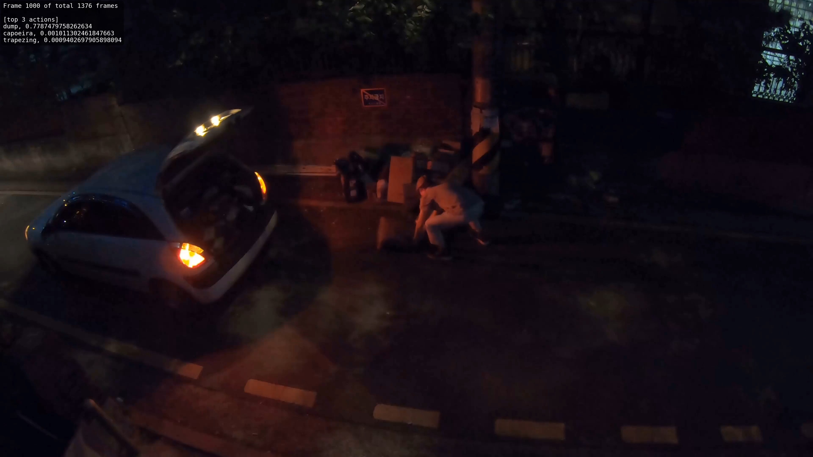
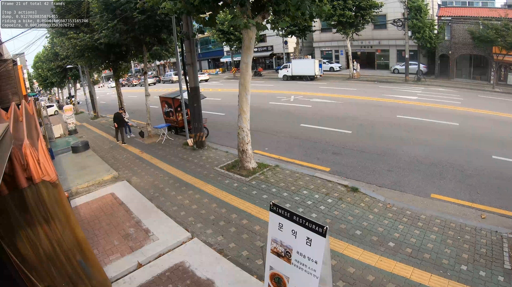
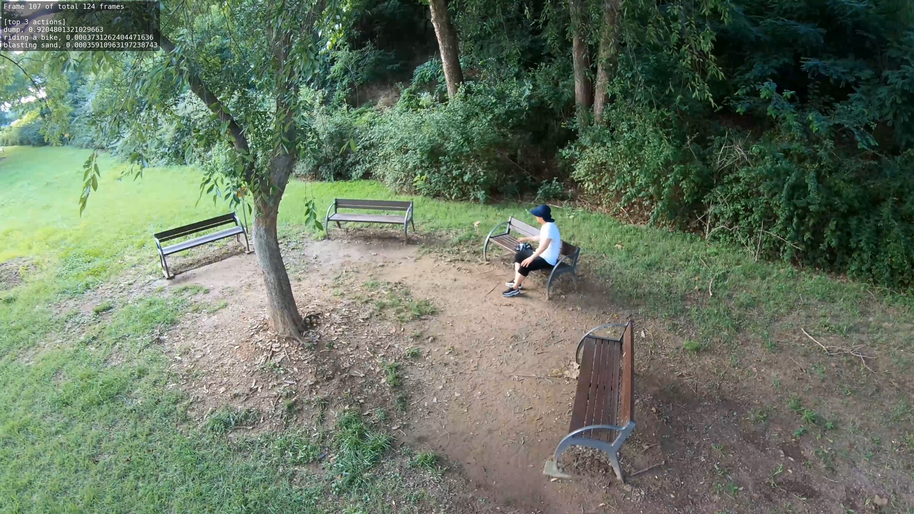
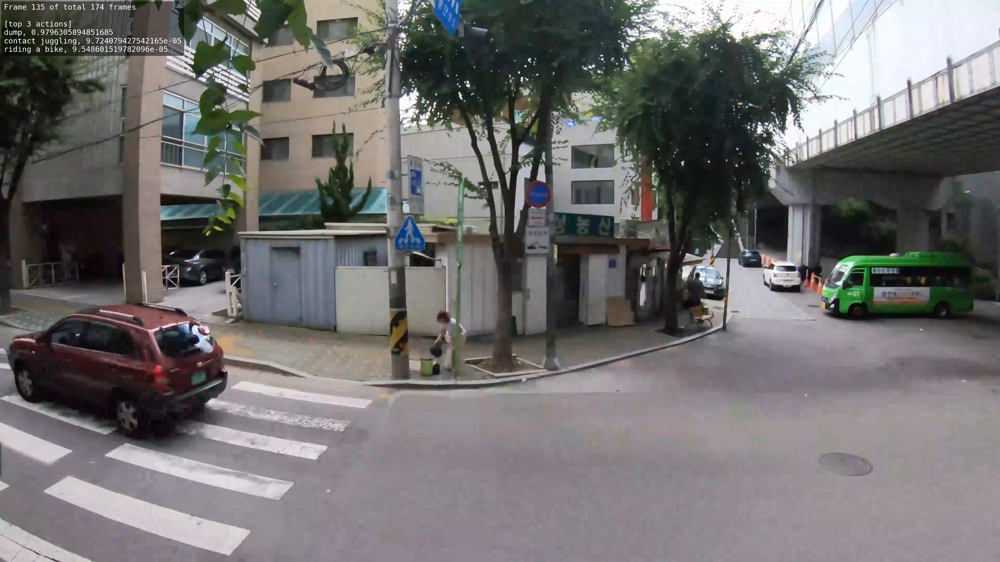

# 쓰레기 불법 투기 감지를 위한 영상처리 알고리즘 연구

## Introduction

### Features
- 행동 인식(Action Recognition) 신경망을 활용한 불법 쓰레기 무단 투기 행동 감지
- MMaction2에서 지원하는 Kinetics-400으로 사전학습된 I3D(Inflated 3D ConvNet) 신경망을 미세 조정(Fine Tuning) 학습을 진행하여 성능 개선
- AI-HUB에서 제공하는 [이상행동 CCTV 영상](https://aihub.or.kr/aihubdata/data/view.do?currMenu=&topMenu=&aihubDataSe=data&dataSetSn=171)의 투기(dump) 데이터 셋을 사용하여 미세 조정 학습 진행
### I3D(Inflated 3D ConvNet)


- 비디오 데이터의 행동 인식을 위해 설계된 딥러닝 모델로, 2D CNN을 기반으로 3D CNN으로 확장한 모델
- 각 컨볼루션 필터가 2D 대신 3D로 작동하며, 동영상 데이터를 처리할 수 있도록 시간 축 정보도 포함됨
- RGB 데이터와 Optical Flow 데이터를 3D Conv로 처리하여 시간 흐름에 따른 공간적 변화를 학습


- Google의 Inception V1 아키텍처를 3D로 확장하여 설계되었음

## Installation

**가상환경 생성**
```
python3.8 -m venv venv
source ./venv/bin/activate
pip install -U pip
```

#### Dependencies
- CUDA11.8
- Python3.8
- pytorch 2.0.0+cu118
- torchvision 0.15.1+cu118


**mmaction 관련 패키지 설치**
```
pip install -U openmim
mim install mmengine
mim install "mmcv==2.1.0"
mim install mmdet
```

**Project build**
```
git clone "this repository" project
cd project
pip install -v -e .
```

## Run
Video input Video output
download link (weight file) : [i3d_imagenet-pretrained-r50-heavy_8xb8-32x2x1-100e_kinetics400-rgb_trained_by_hnu_epoch_40.pth]()

download link (demo video, dump) : [i3d_imagenet-pretrained-r50-heavy_8xb8-32x2x1-100e_kinetics400-rgb_trained_by_hnu_epoch_40.pth]()
```
python demo/demo_visualize.py configs/recognition/i3d/i3d_dense_trained_by_hnu.py \
    i3d_imagenet-pretrained-r50-heavy_8xb8-32x2x1-100e_kinetics400-rgb_trained_by_hnu_epoch_40.pth \
    demo/167-3_cam02_dump02_place04_day_summer.mp4 tools/data/kinetics/label_map_hnu_label.txt \
    --out-filename output.mp4
```

|  |  |
|:-----------------:|:---------------:|
| 투기행위 신뢰도 : 0.78 (야간)             | 투기행위 신뢰도 : 0.98 (주간)           |
|  |  |
| 투기행위 신뢰도 : 0.91 (주간)             | 투기행위 신뢰도 : 0.92 (주간)           |


## Related linkes

- [I3D](https://arxiv.org/pdf/1705.07750) : Quo Vadis, Action Recognition? A New Model and the Kinetics Dataset
- [MMDetection](https://github.com/open-mmlab/mmdetection): OpenMMLab detection toolbox and benchmark.
- [MMAction2](https://github.com/open-mmlab/mmaction2): OpenMMLab Video Action Recognition toolbox and benchmark.
